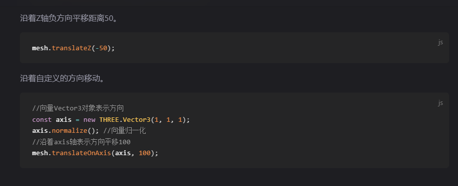
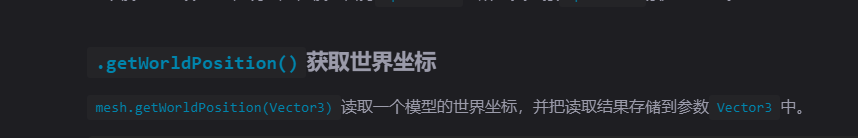

**点模型**

点模型使用的是缓冲类型的几何体 通过bufferAttribute定义说明几何体的顶点数据,此外我们通过定义顶点的材质数据生成顶点材质,在将材质和顶点几个体通过顶点模型对象points 添加到场景中。其他模型实现类似
```js
 const geometry = new THREE.BufferGeometry();
const attribute =  new THREE.BufferAttribute(new Float32Array([ 0, 0, 0, //顶点1坐标
    10, 0, 0, //顶点2坐标
    0, 10, 0, //顶点3坐标
    0, 0, 10, //顶点4坐标
    0, 0, 10, //顶点5坐标
    10, 0, 10,]),3)
geometry.setAttribute('position',attribute)
//定义点模型
const material = new THREE.PointsMaterial({
    color: 0xffff00,
    size: 10.0 //点对象像素尺寸
});

//const material = new THREE.MeshPhongMaterial({color:'#fafafa'}) //高光材质

const cube = new THREE.Points(geometry, material)
scene.add(cube)
```
**线模型**
```js
 const material =  new THREE.LineBasicMaterial({
    color:'#fafafa',
    linewidth:10
})

const cube = new THREE.Line(geometry,material)
```
模型的细分数对于曲面而言细分数越大表面越光滑。
矩形平面举例：
```js
var geometry = new THREE.PlaneGeometry(width, height, widthSegments, heightSegments);
其中width 和height 代表的是矩形模型的长和宽 heightSegments 和 widthSegments 带表是 长和宽的细分数
```

**模型渲染和欧拉角度**
模型中的旋转属性用rotation属性同样可以使用set进行设置 同样也可以使用.xyz的方式去给对应的轴线设置旋转角度。此外模型还有对应轴线设置的方法 rotateY() rotateZ() rotateX()等设置 
rotation中的参数则是欧拉角度（Eulter）
```js
// 表示的是x轴 45度y轴0度z轴 90度
const eulter  =  new THREE.Eulter(Math.PI/4,0,Math.PI/2)
mesh.rotation.setFromEuler(eulter.rotation)
mesh.rotation.x =  Math.PI/4

```
**克隆和复制(clone,copy)**
常用的是clone()这样会得到一个和源对象一样的材质对象同样不会影响源对象
常见的方式就是修改多个材质对象的材质属性。
```js
const mesh2 = mesh.clone();
// 克隆几何体和材质，重新设置mesh2的材质和几何体属性
mesh2.geometry = mesh.geometry.clone();
mesh2.material = mesh.material.clone();
// 改变mesh2颜色，不会改变mesh的颜色
mesh2.material.color.set(0xff0000);

```
**group**

threejs中的group是一个组的概念可以理解成是一个组合框 他可以将材质物体，灯光 环境等放在一起 通过group的移动等操作可以统一的将组内的元素进行移移动等处理。

**遍历模型结构**

我们在创建模型的时候会给模型一个name的属性用于标记模型的名称 因此我们可以通过name属性获取对应模型的数据
```js
// 批量创建多个长方体表示高层楼
const group1 = new THREE.Group(); //所有高层楼的父对象
group1.name = "高层";
for (let i = 0; i < 5; i++) {
    const geometry = new THREE.BoxGeometry(20, 60, 10);
    const material = new THREE.MeshLambertMaterial({
        color: 0x00ffff
    });
    const mesh = new THREE.Mesh(geometry, material);
    mesh.position.x = i * 30; // 网格模型mesh沿着x轴方向阵列
    group1.add(mesh); //添加到组对象group1
    mesh.name = i + 1 + '号楼';
    // console.log('mesh.name',mesh.name);
}
group1.position.y = 30;


const group2 = new THREE.Group();
group2.name = "洋房";
// 批量创建多个长方体表示洋房
for (let i = 0; i < 5; i++) {
    const geometry = new THREE.BoxGeometry(20, 30, 10);
    const material = new THREE.MeshLambertMaterial({
        color: 0x00ffff
    });
    const mesh = new THREE.Mesh(geometry, material);
    mesh.position.x = i * 30;
    group2.add(mesh); //添加到组对象group2
    mesh.name = i + 6 + '号楼';
}
group2.position.z = 50;
group2.position.y = 15;

const model = new THREE.Group();
model.name='小区房子';
model.add(group1, group2);
model.position.set(-50,0,-25);


//遍历获取的
model.traverse(function(obj) {
    console.log('所有模型节点的名称',obj.name);
    // obj.isMesh：if判断模型对象obj是不是网格模型'Mesh'
    if (obj.isMesh) {//判断条件也可以是obj.type === 'Mesh'
        obj.material.color.set(0xffff00);
    }
});

```
可以通过scene.getObjectByName()来获取对应模型名称的模型组 
**本地坐标(局部坐标)和世界坐标**

本地坐标也成为局部坐标表示的是模型对象自身的坐标信息,一旦模型对象创建完成本地坐标一半不会改变
世界坐标表示的是模型自身添加到group后的坐标 世界坐标则表示的是模型的本地坐标和组坐标的和。

模型坐标的原点默认与几何体中的中心点重合。
模型材质的隐藏和现实 可以通过visible属性实现
```js
 const scane =  new THREE.scane()
scane.visible=false
mesh.material.visible =false;
注意的是同一个材质会因为不同的材质对象隐藏而隐藏
```
**颜色贴图**
```js
const geometry = new THREE.PlaneGeometry(200, 100);
//纹理贴图加载器TextureLoader
const texLoader = new THREE.TextureLoader();
// .load()方法加载图像，返回一个纹理对象Texture
const texture = texLoader.load('./earth.jpg');
const material = new THREE.MeshLambertMaterial({
    // 设置纹理贴图：Texture对象作为材质map属性的属性值
    map: texture,//map表示材质的颜色贴图属性
    
});
// 新版的webgl需要设置颜色的编码方式。
texture.colorSpace  = THREE.SRGBColorSpace;//设置为SRGB颜色空间

```
**自定义顶点的uv 坐标**
```js

/**纹理坐标0~1之间随意定义*/
const uvs = new Float32Array([
    0, 0, //图片左下角
    1, 0, //图片右下角
    1, 1, //图片右上角
    0, 1, //图片左上角
]);
// 设置几何体attributes属性的位置normal属性
geometry.attributes.uv = new THREE.BufferAttribute(uvs, 2); //2个为一组,表示一个顶点的纹理坐标
// 我们可以通过
//geometry.attributes.uv 获取uv坐标
 //uv 坐标的范围是0~1之间 原点是0,0 点
```
**纹理贴图的阵列**
```js
纹理贴图的阵列可以理解成是贴图的x,y轴线上的重复方式
// .load()方法加载图像，返回一个纹理对象Texture
const texture = texLoader.load('./瓷砖.jpg');
// 设置阵列模式
texture.wrapS = THREE.RepeatWrapping;//设置重复
texture.wrapT = THREE.RepeatWrapping;
// uv两个方向纹理重复数量
texture.repeat.set(12,12);//注意选择合适的阵列数量
```

相机的指向位置。
camera.lookAt(0, 0, 0); 