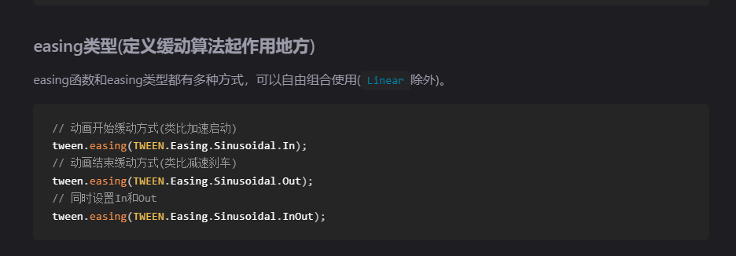
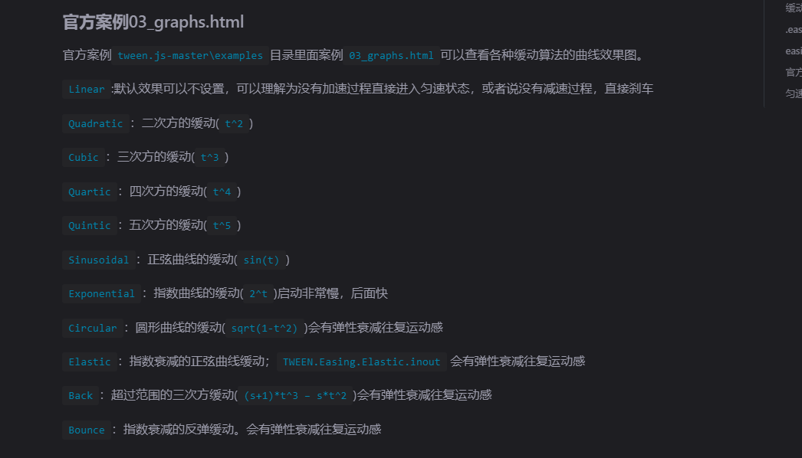

**threejs 中的旋转方向**

threejs中旋转的角度采用的是弧度计算,旋转的方向采用的是右手规则，四指指向的方向为z轴正方向, 逆时针是正方向。顺时针是负方向

**模型辅助器**
***网格辅助器***
```js
  // 添加网格辅助工具
scene.add( new THREE.GridHelper(100, 100, 0.01, 0x00ff00))

 // 添加坐标轴辅助工具
scene.add( new THREE.AxesHelper(100))

// 添加光线辅助工具

scene.add(new THREE.PointLightHelper(new THREE.PointLight(0xff0000, 1, 100), .5))


```

**点模型**

点模型使用的是缓冲类型的几何体 通过bufferAttribute定义说明几何体的顶点数据,此外我们通过定义顶点的材质数据生成顶点材质,在将材质和顶点几个体通过顶点模型对象points 添加到场景中。其他模型实现类似
```js
 const geometry = new THREE.BufferGeometry();
const attribute =  new THREE.BufferAttribute(new Float32Array([ 0, 0, 0, //顶点1坐标
    10, 0, 0, //顶点2坐标
    0, 10, 0, //顶点3坐标
    0, 0, 10, //顶点4坐标
    0, 0, 10, //顶点5坐标
    10, 0, 10,]),3)
geometry.setAttribute('position',attribute)
//定义点模型
const material = new THREE.PointsMaterial({
    color: 0xffff00,
    size: 10.0 //点对象像素尺寸
});

//const material = new THREE.MeshPhongMaterial({color:'#fafafa'}) //高光材质

const cube = new THREE.Points(geometry, material)
scene.add(cube)
```
**线模型**
```js
 const material =  new THREE.LineBasicMaterial({
    color:'#fafafa',
    linewidth:10
})

const cube = new THREE.Line(geometry,material)
```
模型的细分数对于曲面而言细分数越大表面越光滑。
矩形平面举例：
```js
var geometry = new THREE.PlaneGeometry(width, height, widthSegments, heightSegments);
其中width 和height 代表的是矩形模型的长和宽 heightSegments 和 widthSegments 带表是 长和宽的细分数
```

**模型渲染和欧拉角度**
模型中的旋转属性用rotation属性同样可以使用set进行设置 同样也可以使用.xyz的方式去给对应的轴线设置旋转角度。此外模型还有对应轴线设置的方法 rotateY() rotateZ() rotateX()等设置 
rotation中的参数则是欧拉角度（Eulter）
```js
// 表示的是x轴 45度y轴0度z轴 90度
const eulter  =  new THREE.Eulter(Math.PI/4,0,Math.PI/2)
mesh.rotation.setFromEuler(eulter.rotation)
mesh.rotation.x =  Math.PI/4

```
**克隆和复制(clone,copy)**
常用的是clone()这样会得到一个和源对象一样的材质对象同样不会影响源对象
常见的方式就是修改多个材质对象的材质属性。
```js
const mesh2 = mesh.clone();
// 克隆几何体和材质，重新设置mesh2的材质和几何体属性
mesh2.geometry = mesh.geometry.clone();
mesh2.material = mesh.material.clone();
// 改变mesh2颜色，不会改变mesh的颜色
mesh2.material.color.set(0xff0000);

```
**group**

threejs中的group是一个组的概念可以理解成是一个组合框 他可以将材质物体，灯光 环境等放在一起 通过group的移动等操作可以统一的将组内的元素进行移移动等处理。

**遍历模型结构**

我们在创建模型的时候会给模型一个name的属性用于标记模型的名称 因此我们可以通过name属性获取对应模型的数据
```js
// 批量创建多个长方体表示高层楼
const group1 = new THREE.Group(); //所有高层楼的父对象
group1.name = "高层";
for (let i = 0; i < 5; i++) {
    const geometry = new THREE.BoxGeometry(20, 60, 10);
    const material = new THREE.MeshLambertMaterial({
        color: 0x00ffff
    });
    const mesh = new THREE.Mesh(geometry, material);
    mesh.position.x = i * 30; // 网格模型mesh沿着x轴方向阵列
    group1.add(mesh); //添加到组对象group1
    mesh.name = i + 1 + '号楼';
    // console.log('mesh.name',mesh.name);
}
group1.position.y = 30;


const group2 = new THREE.Group();
group2.name = "洋房";
// 批量创建多个长方体表示洋房
for (let i = 0; i < 5; i++) {
    const geometry = new THREE.BoxGeometry(20, 30, 10);
    const material = new THREE.MeshLambertMaterial({
        color: 0x00ffff
    });
    const mesh = new THREE.Mesh(geometry, material);
    mesh.position.x = i * 30;
    group2.add(mesh); //添加到组对象group2
    mesh.name = i + 6 + '号楼';
}
group2.position.z = 50;
group2.position.y = 15;

const model = new THREE.Group();
model.name='小区房子';
model.add(group1, group2);
model.position.set(-50,0,-25);


//遍历获取的
model.traverse(function(obj) {
    console.log('所有模型节点的名称',obj.name);
    // obj.isMesh：if判断模型对象obj是不是网格模型'Mesh'
    if (obj.isMesh) {//判断条件也可以是obj.type === 'Mesh'
        obj.material.color.set(0xffff00);
    }
});

```
可以通过scene.getObjectByName()来获取对应模型名称的模型组 
**本地坐标(局部坐标)和世界坐标**

本地坐标也成为局部坐标表示的是模型对象自身的坐标信息,一旦模型对象创建完成本地坐标一半不会改变
世界坐标表示的是模型自身添加到group后的坐标 世界坐标则表示的是模型的本地坐标和组坐标的和。

模型坐标的原点默认与几何体中的中心点重合。
模型材质的隐藏和现实 可以通过visible属性实现
```js
 const scane =  new THREE.scane()
scane.visible=false
mesh.material.visible =false;
注意的是同一个材质会因为不同的材质对象隐藏而隐藏
```
**颜色贴图**
```js
const geometry = new THREE.PlaneGeometry(200, 100);
//纹理贴图加载器TextureLoader
const texLoader = new THREE.TextureLoader();
// .load()方法加载图像，返回一个纹理对象Texture
const texture = texLoader.load('./earth.jpg');
const material = new THREE.MeshLambertMaterial({
    // 设置纹理贴图：Texture对象作为材质map属性的属性值
    map: texture,//map表示材质的颜色贴图属性
    
});
// 新版的webgl需要设置颜色的编码方式。
texture.colorSpace  = THREE.SRGBColorSpace;//设置为SRGB颜色空间

```
**自定义顶点的uv 坐标**
```js

/**纹理坐标0~1之间随意定义*/
const uvs = new Float32Array([
    0, 0, //图片左下角
    1, 0, //图片右下角
    1, 1, //图片右上角
    0, 1, //图片左上角
]);
// 设置几何体attributes属性的位置normal属性
geometry.attributes.uv = new THREE.BufferAttribute(uvs, 2); //2个为一组,表示一个顶点的纹理坐标
// 我们可以通过
//geometry.attributes.uv 获取uv坐标
 //uv 坐标的范围是0~1之间 原点是0,0 点
```
**纹理贴图的阵列**
```js
纹理贴图的阵列可以理解成是贴图的x,y轴线上的重复方式
// .load()方法加载图像，返回一个纹理对象Texture
const texture = texLoader.load('./瓷砖.jpg');
// 设置阵列模式
texture.wrapS = THREE.RepeatWrapping;//设置重复
texture.wrapT = THREE.RepeatWrapping;
// uv两个方向纹理重复数量
texture.repeat.set(12,12);//注意选择合适的阵列数量
```

相机的指向位置。
camera.lookAt(0, 0, 0); 

**纹理.encoding和渲染器**
为了正常的渲染一般 颜色贴图的.encoding 属性和渲染器的,outputEncoding属性保持一致。
```js
  const texture = new THREE.TextureLoader().load('./earth.jpg');
texture.colorSpace = THREE.LinearEncoding;//默认值


//解决加载gltf格式模型颜色偏差问题
renderer.outputColorSpace = THREE.sRGBEncoding;

```
**模型加载添加或者更换贴图**
```js
const texLoader = new THREE.TextureLoader();
const texture = texLoader.load('./黑色.png');// 加载手机mesh另一个颜色贴图
texture.encoding = THREE.sRGBEncoding; //和渲染器.outputEncoding一样值
loader.load("../手机模型.glb", function (gltf) {
    const mesh = gltf.scene.children[0]; //获取Mesh
    mesh.material.map = texture; //更换不同风格的颜色贴图
})

如上如果直接给模型加载贴图的话 会发现贴图是反的,这是应为贴图texture 中的存在flipy属性默认是true
表示的是贴图翻转,此时我们就得将这个属性设置为false

texture.flipY =  false
```
**PBR材质**
所谓的pbr就是物理模型 这种模型对于光照的反射更加的贴近真实物体所处的环境。
常见的材质有MeshStanderMaterial和MeshPhysicalMaterial两种材质。

pbr材质的金属度
```js
const mest = new THREE.MeshStandardMaterial({
    metalness: 1.0,//金属度属性
    roughness:0.5//粗糙度
})
通过 metalness 属性设置金属度 此值在0~1之间 1代表的是金属
通过 roughness 属性表示物体表单的粗糙度 此值在0~1 之间 1 表示镜子。
```
pbr材质的环境贴图

pbr材质因为是高度模仿显示生活 在使用的时候需要添加一个环境贴图,这个贴图则是立体的贴图
通过CubeTextureLoader贴图加载器。
```js
const textureCube = new THREE.CubeTextureLoader()
    .setPath('./环境贴图/环境贴图0/') //这是图片的前缀地址。
    .load(['px.jpg', 'nx.jpg', 'py.jpg', 'ny.jpg', 'pz.jpg', 'nz.jpg']);
    // CubeTexture表示立方体纹理对象，父类是纹理对象Texture 
new THREE.MeshStandardMaterial({
    metalness: 1.0,
    roughness: 0.5,
    envMap: textureCube, //设置pbr材质环境贴图
})
```
**渲染器**
```js
 renderer.setClearAlpha(0.8);//设置背景透明度 0-1 
const renderer = new THREE.WebGLRenderer({
    antialias:true,//锯齿状
    alpha: false ,//设置背景透明
    preserveDrawingBuffer:true,//将图片可以帮存下来
})

renderer.setClearColor(0xb9d3ff, 0.4); //设置背景颜色和透明度


```
```js
//将图片保存下来

document.getElementById('download').addEventListener('click',function(){
    // 创建一个超链接元素，用来下载保存数据的文件
    const link = document.createElement('a');
    // 通过超链接herf属性，设置要保存到文件中的数据
    const canvas =  render.domElement
    link.href = canvas.toDataURL('image/png');
    link.download = 'threejs.png'; //下载文件名
    link.click(); //js代码触发超链接元素a的鼠标点击事件，开始下载文件到本地
})


```
**深度冲突**
实际的开发过程中会遇到模型闪烁的问题,这个问题产生的原因就是模型的深度冲突。
解决方法 我们一般设置渲染器的对数深度缓冲区
```js
const renderer = new THREE.WebGLRenderer({
    // 设置对数深度缓冲区，优化深度冲突问题
    logarithmicDepthBuffer: true
});
同时设置mesh 的位置
mesh.position.z=0.1
```
**模型加载的进度条**
```js
loader.load("../工厂.glb", function (gltf) {
    model.add(gltf.scene);
    //加载完成后进度条消失。
    document.getElementById("container").style.display = 'none';
}, function (xhr) {
    // 控制台查看加载进度xhr
    // 通过加载进度xhr可以控制前端进度条进度   
    const percent = xhr.loaded / xhr.total;
    console.log('加载进度' + percent);
})

```
**相机**
1.正投影相机
```js
 const width = threeValue.value.clientWidth; //canvas画布宽度
const height = threeValue.value.clientHeight; //canvas画布高度
const k = width / height; //canvas画布宽高比
const s = 600;//控制left, right, top, bottom范围大小
const camera = new THREE.OrthographicCamera(-s * k, s * k, s, -s, 1, 8000);
参数分别是渲染空间的左边界,右边界,上边界,下边界,近界面,远截面。

```
2.透视相机
```js
const width = threeValue.value.clientWidth; //canvas画布宽度
const height = threeValue.value.clientHeight;
const camera =  new THREE.PerspectiveCamera(75,width/height,0,1,1000)
参数分别是 可视角度  长宽比 近截面 远截面
```
camera.up.set(0,-1,0) 可以设置相机的状态 类比于我们拍照手机的横屏和竖屏等。
注意如果camera.up后得通过  camera.lookAt(0,0,0); 重新设置相机姿态。
这两种的使用场景 对于模拟人眼的场景用的都是透视相机，对于只是查看的场景 用的是正交 比如查看全中国的地图，2d可视化

**包围盒**

包围盒是包围模型所有顶点的最小的盒子。

**透视相机OribitControls相机轨道**

常用的属性：
```js
controls.enblePan =false //禁用右键拖拽
control.enableZoom =  false//禁用滚轮缩放
control.enableRotate =  false // 禁用左键旋转
controls.target.set(x, y, z);//controls.target 的坐标务必和相机的lookAt()对应的坐标保持一致。
因为内部仍然执行的是相机的lookAt()
controls.maxDistance = 500;//相机位置与观察目标点最大值
controls.minDistance = 200;//相机位置与观察目标点最小值
```
**地图相机空间MapControls**
**精灵材质**

精灵材质模型 不需要我们创建物体
```js
const texture = new THREE.TextureLoader().load("./光点.png");
const spriteMaterial = new THREE.SpriteMaterial({
  color:0x00ffff,//设置颜色
    rotation:Math.PI/4 //设置惊醒材质的旋转角度
    map:texture//通过map 可以设置贴图
    
    
});
// 创建精灵模型对象，不需要几何体geometry参数
const sprite = new THREE.Sprite(spriteMaterial);
sprite.scale.set(12,23)//可以设置默认矩形的长宽


scane.add(sprite);
精灵材质默认的物体是平面的矩形和网格模型中de PlaneGeometry不同点在于精灵材质不会因为相机的旋转形状发生改变

//可以用来生成星星
```
**Raycaster射线拾取器**
一般我们常用的模型点击的时候获取对应点击的模型的时候就会使用到射线拾取模型
 首先创建射线拾取器
```js
  const raycaster = new THREE.Raycaster();
```
其次要创建射线的开始点和方向
```js
raycaster.ray.origin  =  new THREE.Vector3(100,0,0)
raycaster.ray.direction = new THREE.Vector3(1,0,0)//方向的节点必须是单元节点1
```
接着就要进行交叉计算 通过intersectObjects()
```js
 const intersects =  new THREE.intersectObject(group.children,true)//参数是一个group 或者是[mesh,mesh,mesh]
//intersects.lenght>0 的时候则表示是选中的模型  第二个参数表示的是 检查所有的孩子

```
注意射线拾取的时候，mesh1, mesh2, mesh3位置要确保更新的情况下，执行射线计算，threejs一般是渲染器执行一次.render()之后，你设置的mesh.position或者mesh父对象的position才会真实生效。
```JS
render()
// 注意更新下模型的世界矩阵，你设置的mesh.position生效，再进行射线拾取计算
model.updateMatrixWorld(true);
const intersects = raycaster.intersectObjects([mesh1, mesh2, mesh3]);


```
**屏幕坐标转标准设备坐标**
threejs标准坐标的范围是[-1,1] 因此对于屏幕的坐标而言x的范围是[0,offsetWidth]之间 那么x/offsetWidth 的范围就是[0,1] 然后我们给这个基础上乘2就变成了
[0,2] 然后我们在这个基础上-1 就得到了[-1,1]的范围 因此 就有个公式
```js
x =  px/width *2 -1
y =  py/height *2 -1
```

**通过raycaster进行模型拾取以及模型边框展示**

通过鼠标的点击事件我们进行模型的拾取
```js
render.domElement.addEventListener('click',function(event){
 const px = event.offsetX -  threeValue.value.getBoundingClientRect().left;
 const py = event.offsetY -  threeValue.value.getBoundingClientRect().top;
 //屏幕坐标px、py转标准设备坐标x、y
 //width、height表示canvas画布宽高度
 const x = (px / threeValue.value.clientWidth) * 2 - 1;
 const y = -(py / threeValue.value.clientHeight) * 2 + 1;
 const raycaster =  new THREE.Raycaster({
  origin:new THREE.Vector3(100,0,0),//创建射线原点
  direaction:new THREE.Vector3(1,0,0)//射线方向
 })

//通过点击点的位置生成射线然后进行模型的选中
 raycaster.setFromCamera(new THREE.Vector2(x,y),camera)
// raycaster.interspectObjects()中的参数分别是
//1.是group 或者mesh的list  group.children必须是mesh list 参数2 表示的是递归便利所有的子模型.
 const intersects =  raycaster.interspectObjects(model.children,true)
 if(intersects.length>0){
  intersects[0].object.material.set('red')
 }
//以上就是我们进行模型选择的过程并且根据选择的模型进行修改当前选中的模型颜色。

})

//接下来我们实现选中后显示选中模型的外轮廓

import { EffectComposer } from 'three/examples/jsm/postprocessing/EffectComposer.js';
import { OutlinePass } from 'three/examples/jsm/postprocessing/OutlinePass.js';
import {RenderPass} from 'three/examples/jsm/postprocessing/RenderPass.js';

const composer = new EffectComposer(renderer);
const renderPass = new RenderPass(scene, camera);
composer.addPass(renderPass);

const outlinePass = new OutlinePass(new THREE.Vector2(threeValue.value.clientWidth, threeValue.value.clientHeight), scene, camera);
outlinePass.visibleEdgeColor.set(0xff0000); // 可见边缘颜色
outlinePass.hiddenEdgeColor.set(0xffffff); // 隐藏边缘颜色
outlinePass.edgeStrength = 5; // 边缘强度
outlinePass.edgeThickness = 1; // 边缘厚度
composer.addPass(outlinePass);

//然后在渲染函数中添加 composer.render()
function render(){
 renderer.render(scene, camera); //执行渲染操作
 if (composer) {
  composer.render();
 }
 requestAnimationFrame(render);
}


render.domElement.addEventListener('click',function(event){
 const px = event.offsetX -  threeValue.value.getBoundingClientRect().left;
 const py = event.offsetY -  threeValue.value.getBoundingClientRect().top;
 //屏幕坐标px、py转标准设备坐标x、y
 //width、height表示canvas画布宽高度
 const x = (px / threeValue.value.clientWidth) * 2 - 1;
 const y = -(py / threeValue.value.clientHeight) * 2 + 1;
 const raycaster =  new THREE.Raycaster({
  origin:new THREE.Vector3(100,0,0),//创建射线原点
  direaction:new THREE.Vector3(1,0,0)//射线方向
 })

//通过点击点的位置生成射线然后进行模型的选中
 raycaster.setFromCamera(new THREE.Vector2(x,y),camera)
// raycaster.interspectObjects()中的参数分别是
//1.是group 或者mesh的list  group.children必须是mesh list 参数2 表示的是递归便利所有的子模型.


 for (let i = 0; i < model.children.length; i++) {
  const group = model.children[i];
  //递归遍历chooseObj，并给chooseObj的所有子孙后代设置一个ancestors属性指向自己
  group.traverse(function (obj) {
 
   if (obj.isMesh) {

    obj.ancestors = obj; //我们选中的mesh
   }
  })
 }
 
 const intersects =  raycaster.interspectObjects(model.children,true)
 if(intersects.length>0){
  outlinePass.selectedObjects =[intersects[0].object.ancestors];
 }


})


```
**raycaster拾取精灵模型**
```js
const randomS =  ()=>{
 const texture =  new THREE.TextureLoader().load('./sunpoint.png')
 const spriteMaterial = new THREE.SpriteMaterial({
  color:0x00ffff,//设置颜色
  rotation:Math.PI/4,

 });


 list.forEach(item=>{
  scene.remove(item)
 })
 for(let i=0;i<10;i++){
  // 创建精灵模型对象，不需要几何体geometry参数
  const sprite = new THREE.Sprite(spriteMaterial);
  sprite.change = function(){
  //复制材质并更换材质颜色
   let spriteMaterials =  sprite.material.clone()
   spriteMaterials.color.set(0xff0000)
   sprite.material = spriteMaterials
  }
  sprite.scale.set(10,10)
  list.push(sprite)
  sprite.position.set(i*20*Math.random()+1,i*20*Math.random()+1,i*20*Math.random()+1)
  scene.add(sprite)
 }
}

renderer.domElement.addEventListener('click',function(event){
 const  px =  event.offsetX - lights.value.getBoundingClientRect().left
 const  py =  event.offsetY - lights.value.getBoundingClientRect().top
 const  x =  (px/ lights.value.clientWidth)*2 -1
 const  y =  -(py/ lights.value.clientHeight)*2 + 1
 console.log(x,y)
 //创建射线拾取
 const raycaster =  new THREE.Raycaster()

 //根据点击的xy 重新定义射线
 raycaster.setFromCamera(new THREE.Vector2(x, y), camera);
 //检测射线是否与场景中的物体相交

 const intersects =    raycaster.intersectObjects(scene.children,true);
 console.log(intersects,'intersects')

 if(intersects.length>0){
  intersects[0].object.change()
 }

})

```
**场景标注**
通过css2dObject这个库我们可以将世界坐标转换成我们canvas中的坐标。
```js
import { CSS2DRenderer,CSS2DObject } from 'three/addons/renderers/CSS2DRenderer.js';
//通过css2DObject(dom对象) 生成dom 元素
  const tagObject = new CSS2DObject(tags.value);

tagObject.position.set(-55,0,-55); //设置标签的位置一般和mesh.position.set()设置的坐标一直
//添加到场景中。
scene.add(tagObject)

//然后创建渲染器 用来专门的渲染dom元素

const css2Renderer = new CSS2DRenderer();
css2Renderer.render(scene, camera);

css2Renderer.setSize(threeValue.value.clientWidth, threeValue.value.clientHeight);

css2Renderer.domElement.style.position = 'absolute';
css2Renderer.domElement.style.top = '0px';
css2Renderer.domElement.style['pointer-events']='none';
css2Renderer.domElement.style.overflow = "auto";
css2Renderer.domElement.style.color = 'red';
css2Renderer.domElement.style.zIndex =2;


threeValue.value.appendChild(css2Renderer.domElement);
css2Renderer.render(scene, camera);

```
在我们通过鼠标的方式去选中某些模型 并且在对应的模型上添加标注的时候 点击后得重新渲染。
css2Renderer.render()

**动画库tween.js**

使用tween.js 进行相机飞行 
```js
camera.position.set(202, 123, 125);
new TWEEN.Tween(camera.position)
.to({x: 202,y: 123,z: 50}, 3000)
// tweenjs改变参数对象的过程中，.onUpdate方法会被重复调用执行
.onUpdate(function(){
  camera.lookAt(0, 0, 0);
})
.start()

//然后再render函数中进行 Tween.update()操作
```
相机围绕着模型进行圆周运动
```js
  const R = 100; //相机圆周运动的半径
new TWEEN.Tween({angle:0})
        .to({angle: Math.PI*2}, 16000)
        .onUpdate(function(obj){
         camera.position.x = R * Math.cos(obj.angle);
         camera.position.z = R * Math.sin(obj.angle);
         camera.lookAt(0, 0, 0);
        })
        .start()
``` 
tween.js还支持了回调函数.onStart() onUpdate() onComplete()
分别是：
```js
onStart() //动画开始执行触发
onUpdate() //动画执行过程中,一直被调用执行
onComplete()//动画正常执行完触发
//.onUpdate(function(obj){})结构中，obj对应的是new TWEEN.Tween(pos)的参数对象pos。也就是new Tween({})中的参数对象。

```
利用tweenjs实现点击模型相机视图的更新
```js
const worldPosition =  new THREE.VECTOR3()
mesh.getWorldPosition(worldPositon)// 获取mesh的世界坐标并且赋值给worldPostion 参数。
     //利用动画点击对应的模型进行视图飞行。
const pos2 = worldPosition.clone().addScalar(30);//向量的x、y、z坐标分别在pos基础上增加30
new TWEEN.Tween(camera.position)
        .to({
         x: pos2.x,
         y: pos2.y,
         z: pos2.z,
        }, 3000)
        // tweenjs改变参数对象的过程中，.onUpdate方法会被重复调用执行
        .onUpdate(function(obj){
         //这里可以设置相机的位置朝向
         camera.lookAt(0, 0, 0);
        })
        .start()
TWEEN.update()

```
**缓慢动画**

设置缓动动画可以使得动画更加的自然
```js
new TWEEN.Tween(camera.position)
.to({x: 300,y: 300,z: 300}, 3000)
.start()
.easing(TWEEN.Easing.Sinusoidal.InOut)//进入和结束都设置缓动
```
缓慢动画的语法结构
```js
new TWEEN.Tween().easying(TWEEN.Easing.easying函数,easying类型)

```


**模型的淡入淡出**
```js
// 模型淡入
material.transparent = true;//开启透明计算
material.opacity = 0.0;//完全透明

// new TWEEN.Tween(material)
new TWEEN.Tween({opacity:material.opacity})
.to({opacity:1.0}, 3000)
.onUpdate(function(obj){
    material.opacity = obj.opacity
})
.onComplete(function(){
    //动画结束：关闭允许透明，恢复到模型原来状态
    material.transparent = false;
})
.start();
```
**数学几何计算**
***threejs坐标系和三角函数***
在threejs中如果我们想实现弧度到度或者度到弧度我们可以使用threejs中的MathUtils工具类可以帮助我们快速的实现相互的转换
```js
  const angle = THREE.MathUtils.radToDeg(Math.PI); //弧度转度
  
  const tes = THREE.MathUtils.degToRad(30); //度转弧度

```
***三维向量Vector3***
三维向量的加法通过addVectors(向量1,向量2)
```js
const A = new THREE.Vector3(30, 30, 0);// 人起点A
// walk表示运动的位移量用向量
const walk = new THREE.Vector3(100, 50, 0);
const B = new THREE.Vector3();// 人运动结束点B
// addVectors的含义就是参数中两个向量xyz三个分量分别相加
B.addVectors(A,walk);
console.log('B',B);
```
此外向量的加法还可以通过add()方法进行实现
```js

const A = new THREE.Vector3(30, 30, 0);// 人起点A
// walk表示运动的位移量用向量
const walk = new THREE.Vector3(100, 50, 0);
const  b =  a.add(walk)
如果不想改变a的值也可以通过clone()的方式去实现
const b =  a.clone().add(walk)

```
向量的复制可以通过.copy()
```js
const a =  new THREE.Vector3()
mesh.position.cop(a)
//将网格材质模型的坐标复制到a属性中。
```
multiplyScalar表示向量想，x,y,z 方向上的乘积
```js
const a =  new THREE.Vector3(10,10,10)
const b =  a.clone().multiplyScalar(2)
console.log(b) (20,20,20)

```
三维场景中两点中间的距离
```js

const A = new THREE.Vector3(30, 30, 0);// 人起点A
const B = new THREE.Vector3(130,80,0);// 人运动结束点B
// 3D空间，A和B两点之间的距离
const L = Math.sqrt(Math.pow(B.x-A.x,2) + Math.pow(B.y-A.y,2) + Math.pow(B.z-A.z,2));
```
向量的减法运算 用.subVectors() 该方法进行 和加法addVectors() 用法类似,同理.sub() 和.add 的方法类似。
```js

const A = new THREE.Vector3(30, 30, 0);
const B = new THREE.Vector3(130,80,0);
const AB = new THREE.Vector3();
AB.subVectors(B,A);
```
向量的长度用.length表示。
**向量归一化**
向量归一化.normalize() 就是等比例的缩放向量的xyz使得向量的长度为1 并且一般用归一化表示向量的方向。
```js
const dir = new THREE.Vector3(1, 1, 0);
dir.normalize(); //向量归一化
//Vector3(√2/2, √2/2, 0)   Vector3(0.707, 0.707, 0)
console.log('dir',dir);
```
**.translateOnAxis()移动**
模型可以根据向量的方向进行移动
```js
//模型沿着AB方向移动100个距离。
mesh.translateOnAxis(AB,100)
```
camera.getWorldDirection()获取相机视线方向

**生成箭头辅助线**

箭头辅助线函数 ArrowHelper(方向,长度,指向的目标模型)
我们在计算的时候可以通过箭头辅助线的方式查看向量方向和计算值
```js
//生成可视化的小球。
const A =  new THREE.Vector3(0,3,0)
const B =  new THREE.Vector3(8,0,0)
const meshA =  createMesh(0x00ff00,1)
meshA.position.copy(A)

const meshB = createMesh(0x00ff00,1)
meshB.position.copy(B)
function createMesh(color,r){
 const box =  new THREE.CircleGeometry(r)
 const  material = new THREE.MeshBasicMaterial({color})
 const mesh =  new THREE.Mesh(box,material)
 return mesh


}
const group = new THREE.Group()
group.add(meshA,meshB)
scene.add(group)
//生成箭头
const AB =  B.clone().sub(A)
const L =  AB.length()
//生成向量的方向
const dir =  AB.clone().normalize()
//生成箭头
const arrowHelper =  new THREE.ArrowHelper(dir,A,L)
group.add(arrowHelper)

```
**第一三人称漫游**
我們可以通过时间和速度的方式算出位置 然后更新模型的位置
```JS
document.addEventListener('keydown', (event) => {
  if(event.keyCode==87){
    keywordMap.keyW = true
  }
  console.log(event,keywordMap.keyW,'-wefwefwef')
});
const  clock =  new THREE.Clock()
const v =  new THREE.Vector3(0,0,3)
// 循环渲染
function render() {
 if(keywordMap.keyW){
     //获取时间
  let datetime =  clock.getDelta()
  //速度乘时间等于点的距离
  const depo =v.clone().multiplyScalar(datetime)
  group.position.add(depo)
 }
 requestAnimationFrame(animate)
 renderer.render(scene, camera)
 TWEEN.update();
}
render()
```
如果我们想控制一直按键加速的话可以如下实现
```js
document.addEventListener('keydown', (event) => {
  if(event.keyCode==87){
    keywordMap.keyW = true
  }
  console.log(event,keywordMap.keyW,'-wefwefwef')
});
const  clock =  new THREE.Clock()
const v =  new THREE.Vector3(0,0,3) //初始速度
// 循环渲染
function render() {
 if(keywordMap.keyW){
     //获取时间
  let datetime =  clock.getDelta()
  //先假定方向
  const front = new THREE.Vector3(0,0,1);
  v.add(front.multiplyScalar(a * deltaTime));
  //速度乘时间等于点的距离
  const depo =v.clone().multiplyScalar(datetime)
  group.position.add(depo)
 }
 requestAnimationFrame(animate)
 renderer.render(scene, camera)
 TWEEN.update();
}
render()
```
**设置阻尼效果**

其实所谓的阻尼效果就是我们不进行键盘的控制事件 后由系统自动的实现物体的停止
代码如下
```js
// 用三维向量表示玩家角色(人)运动漫游速度
const v = new THREE.Vector3(0, 0, 0);//初始速度设置为0
const a = 12;//WASD按键的加速度：调节按键加速快慢
const damping = -0.1;//阻尼 当没有WASD加速的时候，人、车等玩家角色慢慢减速停下来
// 渲染循环
const clock = new THREE.Clock();

function render() {
 const deltaTime = clock.getDelta();
 if (keywordMap.keyW) {    // 这里通过键盘的按下和谈起的状态去控制速度的大小
  //先假设W键对应运动方向为z
  const front = new THREE.Vector3(0, 0, 1);
  if (v.length() <4) {//限制最高速度
   // W键按下时候，速度随着时间增加
   v.add(front.multiplyScalar(a * deltaTime));
  }
 }

 // 阻尼减速
 v.addScaledVector(v, damping); // v乘damping的这个变量 再和v 相加再复制给a
 console.log(v)
 //更新玩家角色的位置  当v是0的时候，位置更新也不会变化
 const deltaPos = v.clone().multiplyScalar(deltaTime);
 group.position.add(deltaPos);


 renderer.render(scene, camera);
 requestAnimationFrame(render);
 TWEEN.update()
}

render();


```
**相机跟着玩家走**

相机跟着玩家走的思路在于,我们不通过轨道控制器去修改相机的位置。而是将相机和玩家作为一个整体添加到一个group中添加到组中 实现了相机跟随的效果。  相机的far角度会影响视角查看的范围大小。

**物品左右移动**

```js
首先物品左右移动的话我们通过鼠标的移动控制物品的渲染角度 同时控制相机的旋转角度 实现物品的移动, 但是发现物品在移动的时候 只能上下左右移动 斜着走
这是因为我们固定了物品的移动方向  我们可以通过group.getWorldDirection()来获取物品的方向向量  从而控制物品的移动
物品左右方向的移动的话我们可以通过向量的叉乘来实现。  两个向量叉乘的结果就是垂直于两个向量的向量 用右手手定则来理解,比如 
v =  up.clone().cross(font) v 方向则是用右手 四根手指的方向是up 手指握住的方向是font 大拇指的方向则是v的方向。


    if(keywordMap.keyA){
     //定义绕着y轴旋转
     const front = new THREE.Vector3();
     //获取相机的方向
     group.getWorldDirection(front);
     const up = new THREE.Vector3(0, 1, 0);//y方向

     const left = up.clone().cross(front);
     v.add(left.multiplyScalar(a * deltaTime));
    }
if(keywordMap.keyD){
 const front = new THREE.Vector3();
 group.getWorldDirection(front);
 const up = new THREE.Vector3(0, 1, 0);//y方向
 //叉乘获得垂直于向量up和front的向量 左右与叉乘顺序有关,可以用右手螺旋定则判断，也可以代码测试结合3D场景观察验证
 const right = front.clone().cross(up);
 v.add(right.multiplyScalar(a * deltaTime));
}


```
**关键帧动画**

关键帧动画就是给定时间节点然后改变模型的属性(位置 旋转 缩放等)

分两步：
1.定义关键帧数据
```js
//定制位置
//定义时间
const time = [ 0,3,6]
//定义数据 这个数据是 THREE.Vector3 类型
const values =  [0,0,0,100,0,0,0,0,0]
//定义关键帧  new THREE.keyframeTrack(属性名,时间,数据)
const positionKF =  new THREE.KeyframeTrack('.position',time,values)

//定义颜色

const colorKF =  new THREE.KeyframeTrack('.material.color',[3,5],[1,0,0 ,0,0,1])
//创建混合器
const mixer = new THREE.AnimationMixer(mesh) //mesh 则是动画的模型数据
//添加关键帧
const clip = new THREE.AnimationClip('clip',6,[positionKF,colorKF])
// 播放动动画
const clipAction = mixer.clipAction(clip);
clipAction.loop()//定义动画是否循环
clipAction.play()//开始动画

// 如果需要这个动画是一个周期的则需要更新动画的时间

const clock = new THREE.Clock()
function render(){
    mixer.update(clock.getDelta())
}


 ```
***动画的暂停和播放***

```js
clipAction.pause() //暂定动画
clipAction.stop() //暂停动画
clipAction.timeScale =1 //设置动画播放速度 默认为1

```
***外部模型已有的动画效果***

一般在实际开发过程中我们不会自己定义动画，而是直接使用外部的模型动画。比如OBJ、FBX等格式的模型。
此时我们只需要获取模型中的动画数据即可（gltf.scene.animations） 然后使用THREE.AnimationMixer(gltf.scene).clipAction(animation[0]) 
生成播放动画对象，然后播放即可。
**物理引擎cannonjs**
所谓的物理引擎其实就是数学计算的引擎，通过数学计算来模拟物理世界。比如在物理引擎中，我们通过向量来模拟物体的速度和位置。物理引擎我们用到的库是cannon.js
通常我们在项目中使用的都是cannon-es 版本。 这个版本支持es6模块化以及typescript.   
在cannon-es中我们也有物体的物理属性 比如 质量 材质 物体坐标 等  通过物理和物理之间必须通过世界来关联 比如 
```js
//创建物体
const shape =  new CONNON.Shape(1)
const sphereMaterial = new CANNON.Material()
// 定义物体的属性
const shapeBody=  new CONNON.body({
 shape:shape,//碰撞体的几何形状
 position: new  CONNON.Vec3(10,0,0), //碰撞体的位置
 material:sphereMaterial,//设置物体的材质
 mass:0.3 //碰撞体的质量
})

// 创建世界

const World    = new CONNON.World()

//设置世界的重力  
World.gravity.set(0,-9.8,0)

//将物体添加到世界
World.addBody(shapeBody)


在模型的render 方法中添加物理引擎的更新代码
function render(){
 world.step(1/60);//更新物理计算   用于近似计算
}


// 通过body.position 我们可以获取到物体场景下物体的位置 可以将这个位置赋值给模型的位置 实现模型的位置更新

mesh.position.copy(body.position)


```
**碰撞反弹**

实际的场景中模型不可以一直的运动在触碰到其他物体也不会停止（穿模） 而是遇到其他物体 会反弹或者不能移动的效果.

```js
// 如上我们定义了碰撞体，但是没有设置碰撞体的材质。

//创建物理环境的碰撞体


const groundMaterial = new CANNON.Material()

const groundBody =  new CONNON.Body({
 mass:0,
 material:groundMaterial,
 shape:new CANNON.Plane() //平面
})
// 改变平面默认的方向，法线默认沿着z轴，旋转到平面向上朝着y方向
groundBody.quaternion.setFromEuler(-Math.PI / 2, 0, 0);//旋转规律类似threejs 平面
//设置碰撞物体的材质后才能 模拟出真实碰撞的效果 铁落在地上和皮球落在地上的碰撞效果


// 设置地面材质和小球材质之间的碰撞反弹恢复系数
const contactMaterial = new CANNON.ContactMaterial(groundMaterial, sphereMaterial, {
 restitution: 0.7, //反弹恢复系数
})

//将材质添加到物理世界中

World.addContactMaterial(contactMaterial)


同时我们还需要再模型中设置碰撞后的旋转方向
planeMesh.rotateX(-Math.PI / 2);

```
物理模型和模型的原点坐标默认是一致的都是0,0,0点   在物理坐标中 通过new CANNON.Box(new CANNON.Vec3(1,1,1)) 则创建的是一个长2 宽2 高2 的立方体
因为new CANNON.Box()的长宽高分别是创建立方的长宽高的一半。

CONNON中 如果想表示多面体的话则采用new CANNON.ConvexPolyhedron()  用顶点组和索引组来表示 多面体的顶点坐标和索引坐标


